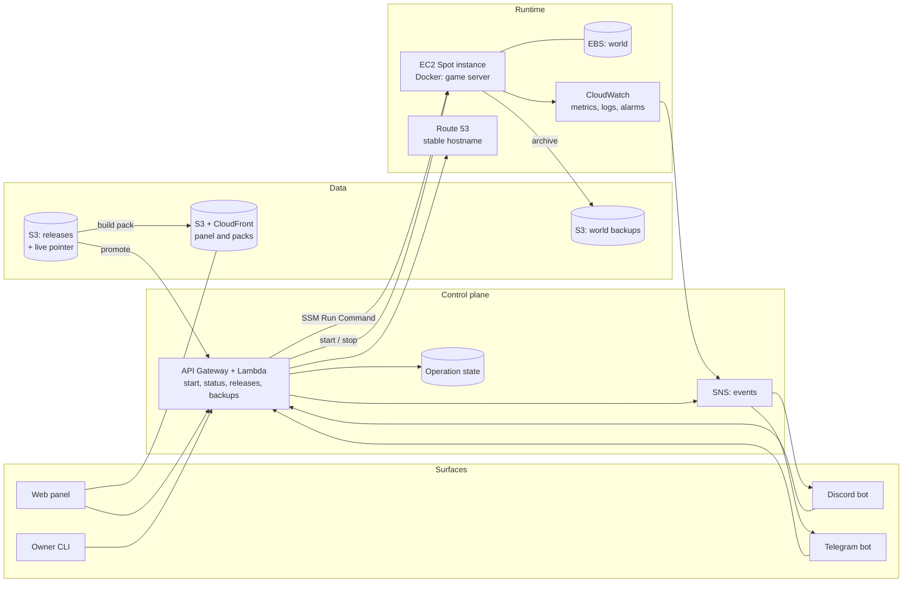

# Spawnpoint

A self-built control plane for one modded Minecraft server on AWS. It starts the server when somebody
asks for it, stops it when the last player leaves, treats the mod set as a versioned artefact, and hands
every player the matching client pack.

The name is a working title. Check it is free on GitHub before claiming it; renaming costs one
`git mv` and a find-and-replace, and is cheap now, awkward later.

> **Status: design stage.** Nothing is deployed. This repository currently holds the architecture, the
> decision records, the cost model and the roadmap. Code starts at milestone M0.

## What it does

| Capability | Detail |
| --- | --- |
| On-demand server | Started by an explicit request from the web panel, Discord or Telegram. Stops itself when idle |
| Versioned mod releases | A mod set is an immutable, named release. Deploy is a pointer move; rollback is moving it back |
| Automatic mod deployment | Promoting a release saves the world, syncs mods, restarts the server, and rolls back if it fails to start |
| Matching client pack | Every release generates a launcher-importable pack, published at a stable URL |
| One API, several surfaces | Web panel, Discord bot, Telegram bot and CLI are all clients of the same control-plane API |
| Sign in with an account you have | Cognito with Google. No passwords stored, anywhere |
| Connect your chat accounts | "Connect Telegram" and "Connect Discord" on the account page, by a one-time code sent to the bot |
| Then sign in from chat too | Once linked, `/panel` in the bot returns a one-minute sign-in link. A chat account never creates an identity, only signs into one it is linked to |
| Whitelist that maintains itself | The Minecraft account is a third linked identity, and `whitelist.json` is generated from the link table. Remove someone once, and they lose the panel, the bots and the game |
| Chat notifications | "X requested the server", "server ready", "release 1.4 promoted", "backup failed" |
| Backups you can restore | World archived after every session and before every release, with a tested restore procedure |

## Why it exists

1. **Run a good server for a small group of friends.** Modded Minecraft needs real memory and CPU, but the
   server sits idle most of the week. Paying for idle time is the main cost, and mismatched mod sets are
   the main daily annoyance. This fixes both.
2. **Learn production engineering by hitting the problems personally.** Infrastructure as code,
   event-driven automation, immutable artefacts, observability, backups, cost control, and written
   decisions — the same discipline as a work system, at a much smaller scale.

The second goal is why every layer is built rather than borrowed. On-demand Minecraft hosting already
exists as a public template; deploying it would give a working server in an evening and teach nothing.
See [ADR-0003](docs/adr/0003-build-not-reuse.md) and [docs/prior-art.md](docs/prior-art.md).

## Principles

- **Build it, do not import it.** Prior art is read for ideas, not copied. The one deliberate exception is
  the game container image, which is not where the learning is. See [ADR-0005](docs/adr/0005-containerised-game-server.md).
- **Nothing runs when nobody plays.** Every fixed monthly cost has to justify itself.
- **State is separate from compute.** The instance is disposable. The world and the mod releases are not.
- **One API, thin clients.** Rules live in one place, so the panel and the bots cannot disagree.
- **Immutable artefacts, mutable pointers.** The same idea as a real deployment pipeline.
- **Write the decision down while the reason is fresh.** See [ADR-0001](docs/adr/0001-record-architecture-decisions.md).

## Non-goals

- Not a commercial hosting product. No multi-tenancy, no billing, no customer support.
- No uptime target. A cold start of one to three minutes is acceptable.
- No Kubernetes. See [ADR-0014](docs/adr/0014-no-kubernetes.md).
- One environment. No dev and prod copies of a five-player server.

## Architecture at a glance



Four flows carry the whole design:

| Flow | Trigger | What happens |
| --- | --- | --- |
| Start | Explicit request from a surface, with an identity | Operation created → instance started → DNS updated → mods reconciled against the live release → container up → "ready" announced |
| Stop | No players for N consecutive checks | World saved → archived to S3 → instance stopped → session length announced |
| Release | The live pointer is written | Announce → save and stop container → sync mods → start → health check → build client pack, or roll back |
| Interruption | Spot two-minute notice | Save world → stop container cleanly → announce → next start reattaches the volume |

Full description, including failure modes: [docs/architecture.md](docs/architecture.md).

## Repository layout

```
docs/              Architecture, roadmap, cost model, runbook, prior art
docs/adr/          Architecture decision records — start here
infra/terraform/   Terraform for all AWS resources
lambdas/           Control-plane handlers, lifecycle automation, chat adapters
server/            Container definition and on-instance scripts
web/               Static control panel and pack download site
scripts/           Local helpers: cut a release, restore a backup, check cost
```

## Decisions

The decision records are the most useful part of this repository today. Twenty-two of them, each with the
alternatives that were rejected and why.

| ADR | Decision | Status |
| --- | --- | --- |
| [0001](docs/adr/0001-record-architecture-decisions.md) | Record architecture decisions | Accepted |
| [0002](docs/adr/0002-host-on-aws.md) | Host on AWS | Accepted |
| [0003](docs/adr/0003-build-not-reuse.md) | Build from scratch, rather than reuse a template | Accepted |
| [0004](docs/adr/0004-ec2-spot-for-the-game-server.md) | Run the game server on EC2 Spot | Accepted |
| [0005](docs/adr/0005-containerised-game-server.md) | Run the game server in a container | Accepted |
| [0006](docs/adr/0006-on-demand-start-and-idle-shutdown.md) | Start on demand, stop when idle | Accepted |
| [0007](docs/adr/0007-ssm-instead-of-ssh.md) | Manage the instance with SSM, not SSH | Accepted |
| [0008](docs/adr/0008-versioned-mod-releases.md) | A mod set is an immutable, versioned release | Accepted |
| [0009](docs/adr/0009-s3-as-mod-source-of-truth.md) | S3 holds releases; promotion deploys | Accepted |
| [0010](docs/adr/0010-world-persistence-and-backups.md) | World on persistent EBS, backups to S3 | Accepted |
| [0011](docs/adr/0011-terraform-for-infrastructure.md) | Terraform for infrastructure | Accepted |
| [0012](docs/adr/0012-web-control-panel.md) | One control-plane API; the panel is one client | Proposed |
| [0013](docs/adr/0013-modpack-distribution.md) | Client pack from S3 and CloudFront | Proposed |
| [0014](docs/adr/0014-no-kubernetes.md) | Do not use Kubernetes | Accepted |
| [0015](docs/adr/0015-observability-and-alerting.md) | CloudWatch signals, chat alerts, Budgets backstop | Proposed |
| [0016](docs/adr/0016-chat-integrations.md) | Discord and Telegram as control surfaces | Proposed |
| [0017](docs/adr/0017-stable-server-address.md) | Stable hostname in Route 53 | Proposed |
| [0018](docs/adr/0018-identity-and-sign-in.md) | Cognito broker; panel sign-in with Google | Proposed |
| [0019](docs/adr/0019-account-linking.md) | Link chat accounts with a one-time code | Proposed |
| [0020](docs/adr/0020-email-channel.md) | SNS email for alerts; SES deferred | Accepted |
| [0021](docs/adr/0021-sign-in-from-linked-chat-account.md) | Chat sign-in, but only into a linked account | Proposed |
| [0022](docs/adr/0022-minecraft-account-as-linked-identity.md) | Minecraft account is a linked identity; whitelist is derived | Proposed |

Index, template and the decisions still to make: [docs/adr/README.md](docs/adr/README.md).

## Cost

The target is a low double-digit USD figure per month for a few evenings of play a week, with the fixed
part — the part billed whether anybody plays or not — kept to a few USD. The model, the drivers and the
traps are in [docs/costs.md](docs/costs.md).

Every figure in this repository is indicative, and marked where it needs verification against the AWS
pricing pages for the chosen region.

## Roadmap

| Milestone | Outcome |
| --- | --- |
| M0 | A playable server, built by hand, deliberately throwaway |
| M1 | The same thing rebuilt in Terraform, with backups and a tested restore |
| M2 | On-demand start and idle stop, with a stable hostname |
| M3 | Versioned mod releases and the deployment pipeline |
| M4 | Control panel, Discord and Telegram bots, client pack distribution |
| M5 | Observability, alerting and cost guardrails |

Definition of done per milestone: [docs/roadmap.md](docs/roadmap.md).

## Glossary

| Term | Meaning here |
| --- | --- |
| Release | An immutable, versioned mod set plus configs and loader versions |
| Live pointer | The one record naming which release the server should run |
| Client pack | The launcher-importable artefact generated from a release |
| Operation | A long-running action with observable state: start, promote, restore |
| Link | The record joining a chat account to one internal identity. Being linked is being authorised, and it is also the sign-in route |
| Cold start | Time from a start request to the server accepting connections |
| Idle watchdog | The check that stops the instance when nobody is online |
| Spot interruption | AWS reclaiming the instance, with a two-minute warning |

## Licence

Not yet chosen. Listed as a decision still to record in the [ADR index](docs/adr/README.md).
