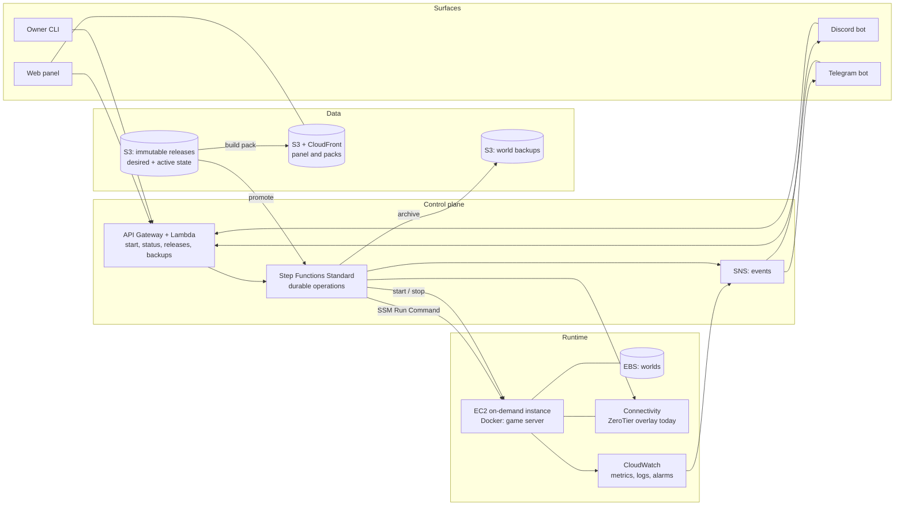

# Spawnpoint

A self-built control plane for one modded Minecraft server on AWS. It starts the server when somebody
asks for it, stops it when the last player leaves, treats the mod set as a versioned artefact, and hands
every player the matching client pack.

The name is a working title.

> **Status: running on AWS.** M0 and M1 are done. The server is live on EC2, reachable only inside the overlay, rebuilt
> from Terraform, and its world has been restored from an S3 archive in a real drill rather than a thought experiment.
> M2 is in progress: start and stop are durable Step Functions workflows, and the idle watchdog is not built yet, so the
> server is still stopped deliberately rather than automatically.
>
> The two tables below separate what runs from what is only designed. Command-by-command records of what was actually
> executed, with verification and rollback beside each change: [M0](docs/aws-m0-command-log.md),
> [M1](docs/aws-m1-command-log.md), [M2](docs/aws-m2-command-log.md).

## What runs today

| Capability | Detail |
| --- | --- |
| A server with no inbound ports | The security group has no inbound rules at all. The game is reachable only inside the ZeroTier overlay, and SSM reaches the host over its outbound connection. See [ADR-0024](docs/adr/0024-connectivity-modes.md) and [ADR-0007](docs/adr/0007-ssm-instead-of-ssh.md) |
| Rebuilt from Terraform | Three roots: the state bucket, the storage that outlives the host, and the host itself. Buckets live in separate state, so an ordinary host teardown cannot take the backups with it |
| Backups that were actually restored | The world is archived to S3 and verified after upload. On 2026-08-13 an archive was downloaded by the instance role, restored onto a fresh volume, reconciled against release `1.0`, and a player joined the recovered world |
| Start and stop as durable operations | Step Functions Standard. Stop rechecks the player count, flushes the world, stops every session container, verifies an immutable backup, and only then stops the instance |
| An immutable release, cut by hand | Release `1.0`: 111 JARs, pinned and hashed. The pipeline that produces the next one is M3 |
| Per-session observability | Prometheus and Grafana come up with the session and go down with it. Prometheus binds to loopback; Grafana is reachable only inside the overlay |

## What is designed, not built

Every row below has a decision record behind it and no code yet. Read the roadmap for the order.

| Capability | Detail |
| --- | --- |
| Started by anyone, stopped by itself | An explicit request from the panel or a bot, and an idle watchdog that saves and stops. Today both ends are a script the owner runs |
| Versioned mod releases | A mod set is immutable. Desired is the requested version; active is the last version that passed health checks |
| Automatic mod deployment | Promoting a release saves the world, syncs mods, restarts the server, and rolls back if it fails to start |
| Updates you approve, not updates that happen | A scheduled check resolves every mod, diffs by hash, and opens a pull request. Five changed mods with changelogs is a decision; a server that updated itself is an incident |
| Preview environments per proposal | A pull request boots a throwaway server on a copy of the real world. Join it and look at your base before approving. A few cents a run |
| Matching client pack | Every release generates a launcher-importable pack, published at a stable URL |
| One API, several surfaces | Web panel, Discord bot, Telegram bot and CLI are all clients of the same control-plane API |
| Sign in with an account you have | Cognito with Google. No passwords stored, anywhere |
| Connect your chat accounts | "Connect Telegram" and "Connect Discord" on the account page, by a one-time code sent to the bot |
| Then sign in from chat too | Once linked, `/panel` in the bot returns a one-minute sign-in link. A chat account never creates an identity, only signs into one it is linked to |
| Whitelist that maintains itself | The Minecraft identity is a third link, and `whitelist.json` is generated from the link table. Remove someone once, and they lose the panel, the bots and the game |
| Several worlds, one at a time | Each pack is a world with its own release line, save data and backups. Start the one you want; the others cost only storage |
| Chat notifications | "X requested the server", "server ready", "release 1.4 promoted", "backup failed" |

## Why it exists

1. **Run a good server for a small group of friends.** Modded Minecraft needs real memory and CPU, but the
   server sits idle most of the week. Paying for idle time is the main cost, and mismatched mod sets are
   the main daily annoyance. This fixes both.
2. **Learn production engineering by hitting the problems personally.** Infrastructure as code,
   event-driven automation, immutable artefacts, observability, backups, cost control, and written
   decisions — the same discipline as a work system, at a much smaller scale.

The second goal is why every layer is built rather than borrowed. On-demand Minecraft hosting already
exists as a public template; deploying it would give a working server in an evening and teach nothing.
See [ADR-0003](docs/adr/0003-build-not-reuse.md) and [docs/prior-art.md](docs/prior-art.md).

## Principles

- **Build it, do not import it.** Prior art is read for ideas, not copied. The one deliberate exception is
  the game container image, which is not where the learning is. See [ADR-0005](docs/adr/0005-containerised-game-server.md).
- **Nothing runs when nobody plays.** Not the bots, not the panel, not the API — no process in this system stays up.
  The fixed cost is storage and nothing else. Defended component by component in
  [docs/architecture.md](docs/architecture.md#what-runs-when-nobody-plays), including the seven more capable options
  declined to keep it true.
- **State is separate from compute.** The instance is disposable. The world and the mod releases are not.
- **One API, thin clients.** Rules live in one place, so the panel and the bots cannot disagree.
- **Immutable artefacts, mutable pointers.** The same idea as a real deployment pipeline.
- **Write the decision down while the reason is fresh.** See [ADR-0001](docs/adr/0001-record-architecture-decisions.md).

## Non-goals

- Not a commercial hosting product. No multi-tenancy, no billing, no customer support.
- No uptime target. A cold start of one to three minutes is acceptable.
- No Kubernetes. See [ADR-0014](docs/adr/0014-no-kubernetes.md).
- One environment. No dev and prod copies of a five-player server.

## Architecture at a glance



Four flows carry the whole design:

| Flow | Trigger | What happens |
| --- | --- | --- |
| Start | Explicit request from a surface, with an identity | Operation created → instance started → connection string published → mods reconciled against the desired release → health check → active committed → "ready" announced |
| Stop | No players for N consecutive checks | World saved → archived to S3 → instance stopped → session length announced |
| Release | A deployment operation writes the desired release | Announce → save and stop container → sync mods → start → health check → commit active, or roll back |
| Restore | The volume is lost, or a release ate content | Newest verified archive downloaded by the instance role → restored onto a fresh volume → release reconciled → health check → play |

A fifth flow, handling a Spot two-minute notice, is designed but **not in use**: the project runs on-demand while
[ADR-0027](docs/adr/0027-spot-request-shape.md) stays deferred.

Full description, including failure modes: [docs/architecture.md](docs/architecture.md).

## Repository layout

```
docs/                       Architecture, roadmap, costs, runbook, measurements, AWS checklist,
                            and a command log per milestone
docs/adr/                   Architecture decision records — start here
infra/terraform-bootstrap/  The state bucket, created before a state backend can exist
infra/terraform-storage/    Buckets that outlive the host, kept in their own state on purpose
infra/terraform/            The host and everything disposable
lambdas/                    Control-plane handlers and the shared domain code
workflows/                  Step Functions ASL definitions for long-running operations
server/                     Compose files, on-instance scripts, tests, observability, release contents
scripts/                    Owner-side helpers: start, stop, audit the account bootstrap
local/                      The local control-plane environment of ADR-0031
web/                        Static panel and pack site — not built
```

## Decisions

Thirty-two records, each with the alternatives that were rejected and why. Three have been superseded and one was
rejected the same day it was written, which is the process working rather than failing — as is
[ADR-0032](docs/adr/0032-on-demand-single-instance.md) replacing ADR-0004 rather than editing it a ninth time.

Measurements deliberately do **not** live in these files. They live in
[docs/measurements.md](docs/measurements.md), [docs/costs.md](docs/costs.md) and [docs/runbook.md](docs/runbook.md),
which are allowed to change. The reason is written up in [docs/adr/README.md](docs/adr/README.md).

| ADR | Decision | Status |
| --- | --- | --- |
| [0001](docs/adr/0001-record-architecture-decisions.md) | Record architecture decisions | Accepted |
| [0002](docs/adr/0002-host-on-aws.md) | Host on AWS | Accepted |
| [0003](docs/adr/0003-build-not-reuse.md) | Build from scratch, rather than reuse a template | Accepted |
| [0004](docs/adr/0004-ec2-spot-for-the-game-server.md) | Run the game server on EC2 Spot | Superseded by 0032 |
| [0005](docs/adr/0005-containerised-game-server.md) | Run the game server in a container | Accepted |
| [0006](docs/adr/0006-on-demand-start-and-idle-shutdown.md) | Start on demand, stop when idle | Accepted |
| [0007](docs/adr/0007-ssm-instead-of-ssh.md) | Manage the instance with SSM, not SSH | Accepted |
| [0008](docs/adr/0008-versioned-mod-releases.md) | A mod set is an immutable, versioned release | Accepted |
| [0009](docs/adr/0009-s3-as-mod-source-of-truth.md) | S3 holds releases; promotion deploys | Superseded by 0030 |
| [0010](docs/adr/0010-world-persistence-and-backups.md) | World on persistent EBS, backups to S3 | Accepted |
| [0011](docs/adr/0011-terraform-for-infrastructure.md) | Terraform for infrastructure | Accepted |
| [0012](docs/adr/0012-web-control-panel.md) | One control-plane API; the panel is one client | Proposed |
| [0013](docs/adr/0013-modpack-distribution.md) | Client pack from S3 and CloudFront | Proposed |
| [0014](docs/adr/0014-no-kubernetes.md) | Do not use Kubernetes | Accepted |
| [0015](docs/adr/0015-observability-and-alerting.md) | Session Grafana/Prometheus; CloudWatch signals and durable alarms | Accepted |
| [0016](docs/adr/0016-chat-integrations.md) | Discord and Telegram as control surfaces | Proposed |
| [0017](docs/adr/0017-stable-server-address.md) | Stable hostname in Route 53 | Superseded by 0024 |
| [0018](docs/adr/0018-identity-and-sign-in.md) | Cognito broker; panel sign-in with Google | Proposed |
| [0019](docs/adr/0019-account-linking.md) | Link chat accounts with a one-time code | Proposed |
| [0020](docs/adr/0020-email-channel.md) | SNS email for alerts; SES deferred | Accepted |
| [0021](docs/adr/0021-sign-in-from-linked-chat-account.md) | Chat sign-in, but only into a linked account | Proposed |
| [0022](docs/adr/0022-minecraft-account-as-linked-identity.md) | Minecraft identity is a link; whitelist derived; `online-mode=false` | Proposed |
| [0023](docs/adr/0023-multiple-worlds.md) | Several worlds, one active at a time | Proposed |
| [0024](docs/adr/0024-connectivity-modes.md) | Connectivity is pluggable: raw address, DNS, or overlay | Accepted |
| [0025](docs/adr/0025-step-functions-for-long-operations.md) | Step Functions for long operations; Lambda for the rest | Accepted |
| [0026](docs/adr/0026-tiered-backups.md) | Tiered backups: incremental snapshots, infrequent archives | Rejected |
| [0027](docs/adr/0027-spot-request-shape.md) | Diversified Spot fleet per session; stop-on-interruption | Deferred |
| [0028](docs/adr/0028-update-proposals.md) | Mod updates as proposals: resolve, diff, approve, promote | Proposed |
| [0029](docs/adr/0029-preview-environments.md) | Every proposal is tested in a throwaway preview environment | Proposed |
| [0030](docs/adr/0030-desired-and-active-release.md) | Desired release is separate from confirmed active release | Accepted |
| [0031](docs/adr/0031-first-class-local-control-plane.md) | First-class local control plane with shared ASL, Lambda and host contracts | Accepted |
| [0032](docs/adr/0032-on-demand-single-instance.md) | Run the game server on one on-demand EC2 instance | Accepted |

Index, template and the decisions still to make: [docs/adr/README.md](docs/adr/README.md).

## Cost

**About $12.45 a month at list price**, and lower while the Free Plan credits apply — for a few evenings of play a
week, with the fixed part kept to a few dollars. Comfortably under the $20 budget alarm.

The figures are now measured rather than estimated: real instance prices, a real world size, a real backup. The model,
the drivers, the traps and an honest comparison against a rented box are in [docs/costs.md](docs/costs.md).

One line dominates everything else, and it is not the instance type: **stopping when nobody plays.** Always on is about
$129 a month. That is why a stop that silently fails is treated as an incident.

## Roadmap

| Milestone | Outcome | State |
| --- | --- | --- |
| M0 | A playable server, built by hand, deliberately throwaway | **Done** 2026-08-13 |
| M1 | The same thing rebuilt in Terraform, with backups and a tested restore | **Done** 2026-08-13 |
| M2 | On-demand start and idle stop, over a stable overlay address | **In progress** — start and stop workflows run; the idle watchdog and the running-hours alarm are next |
| M3 | Versioned mod releases and the deployment pipeline | Release `1.0` cut by hand; the pipeline is not built |
| M4 | One bot and an allow-list; client pack distribution | |
| M5 | Observability, alerting and cost guardrails | Session Grafana already runs; the durable alarms do not |
| M6 | Several worlds — vanilla-plus, techno, magic, techno-magic — one active at a time | |

Definition of done per milestone: [docs/roadmap.md](docs/roadmap.md).

## Glossary

| Term | Meaning here |
| --- | --- |
| Release | An immutable, versioned mod set plus configs and loader versions |
| Desired release | The release the control plane is trying to make true for a world |
| Active release | The last release that started and passed the full health check for a world |
| Client pack | The launcher-importable artefact generated from a release |
| Operation | A long-running action with observable state: start, promote, restore |
| Link | The record joining a chat or Minecraft identity to one internal identity. Being linked is being authorised, and it is also the sign-in route |
| World | A named playable thing: its release line, its save data and its backup lineage together |
| Connectivity mode | How players reach the server: raw address, DNS, or overlay network |
| Cold start | Time from a start request to the server accepting connections |
| Idle watchdog | The check that stops the instance when nobody is online |
| Spot interruption | AWS reclaiming the instance, with a two-minute warning. Designed for, not in use — see [ADR-0027](docs/adr/0027-spot-request-shape.md) |

## Licence

Not yet chosen. Listed as a decision still to record in the [ADR index](docs/adr/README.md).
