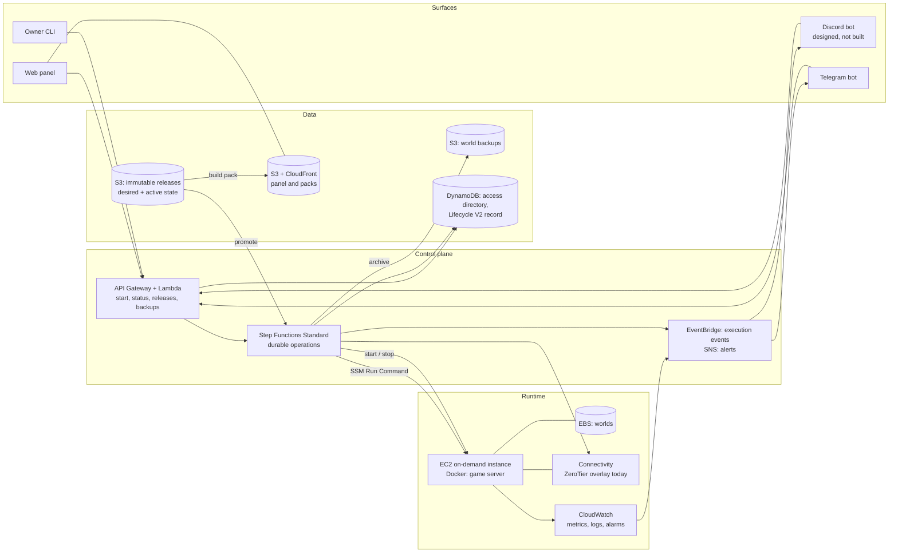

# Spawnpoint

A self-built control plane for private game servers on AWS — one modded Minecraft world today, with Factorio and
Project Zomboid adapters behind the same lifecycle. It starts a world's server when somebody asks for it, stops it
when the last player leaves, treats the mod set as a versioned release, and hands every player the matching client
pack.

The name is a working title.

> **Status: running on AWS, operated from Telegram.** M0 and M1 are done. The server is live on EC2, reachable only
> inside the overlay, rebuilt from Terraform, and its world has been restored from an S3 archive in a real drill rather
> than a thought experiment. M2's start, stop and idle-watchdog path was acceptance-tested on release `1.1`, and on
> 2026-09-11 session control and release promotion cut over to Lifecycle V2 — fenced sessions, one watchdog per
> session, promotion proven end to end in both directions. Players start the server from the Telegram bot or the Mini
> App; an Owner approves who they are. Production is deployed by GitHub Actions from reviewed pull requests.
>
> The two tables below separate what runs from what is only designed. Command-by-command records of what was actually
> executed, with verification and rollback beside each change: [M0](docs/aws-m0-command-log.md),
> [M1](docs/aws-m1-command-log.md), [M2](docs/aws-m2-command-log.md), [M3](docs/aws-m3-command-log.md),
> [bot](docs/aws-bot-command-log.md), [access](docs/aws-access-command-log.md), [web](docs/aws-web-command-log.md).
> The V2 cutover and the promotion drills are recorded in [docs/lifecycle-v2-rollout.md](docs/lifecycle-v2-rollout.md).

## What runs today

| Capability | Detail |
| --- | --- |
| A server with no inbound ports | The security group has no inbound rules at all. The game is reachable only inside the ZeroTier overlay, and SSM reaches the host over its outbound connection. A world may opt into a public address per [ADR-0033](docs/adr/0033-connectivity-as-a-strategy.md), which opens exactly that game's port. See [ADR-0024](docs/adr/0024-connectivity-modes.md) and [ADR-0007](docs/adr/0007-ssm-instead-of-ssh.md) |
| Rebuilt from Terraform | Eleven isolated roots — state bucket, guardrails, the storage that outlives the host, the host, releases, operations, access, access API, bot, web and the GitHub identities. Buckets live in separate state, so an ordinary host teardown cannot take the backups with it |
| Backups that were actually restored | The world is archived to S3 and verified after upload. On 2026-08-13 an archive was downloaded by the instance role, restored onto a fresh volume, reconciled against release `1.0`, and a player joined the recovered world. Every backup now names the wipe and release that produced it |
| Start and stop as durable operations | Step Functions Standard, composed by Lifecycle V2 since 2026-09-11: a fenced lease, one explicit session identity, and a verified stop that rechecks the player count, flushes the world, stops every session container and verifies an immutable backup before the instance stops. See [docs/lifecycle-v2-rollout.md](docs/lifecycle-v2-rollout.md) |
| Session watchdog and release promotion | One watchdog per session, launched by the V2 start; three confirmed empty checks produce a verified backup and stop EC2. Promotion is pointer writes around a fenced V2 stop and start: `1.1 → 34246388450.1 → 1.1` round-tripped in production on 2026-09-11, each leg health-gated and archived |
| An immutable bootstrap release | Release `1.0`: 111 JARs, pinned and hashed, retained as the hand-cut baseline |
| AWS-built releases from preset snapshots | A source adapter verifies and materializes inert authoring input; today the enabled `github-snapshot` adapter receives exact Git commits through GitHub OIDC. A Standard Workflow and ephemeral CodeBuild job then resolve, hash and publish the release manifest-last, per preset ([ADR-0042](docs/adr/0042-preset-scoped-release-identity.md), [ADR-0047](docs/adr/0047-normalize-preset-sources-before-building.md)). A catalog builder publishes which presets are ready. Release `1.1` was the first, built without starting the game host |
| Telegram bot and Mini App | A webhook bot on Lambda — `/server_start`, `/status`, `/address`, `/network`, `/pack`, an inline menu — and a static React Mini App behind CloudFront, both thin clients of the same access API. Deployed 2026-08-27 to 29. See [ADR-0012](docs/adr/0012-web-control-panel.md), [ADR-0016](docs/adr/0016-chat-integrations.md) and [ADR-0037](docs/adr/0037-telegram-only-browser-identity.md) |
| Identity, roles and approval | The access API verifies a Telegram Login Widget signature or Mini App `initData`. A signed-in stranger is a Visitor who sees coarse status only; an Owner approves the observed account and assigns viewer, player, operator or owner. See [ADR-0036](docs/adr/0036-observed-visitors-and-owner-approved-access.md) |
| Worlds, wipes and backups as operations | Create a world from a ready preset release; archive it, start a new wipe, restore a backup into a new wipe, or purge an archived world. Each is a guarded Standard Workflow that stops and backs up an active session first. See [ADR-0040](docs/adr/0040-reusable-presets-and-world-wipes.md) |
| Chat notifications | Step Functions execution events reach a notifier Lambda: start requested, ready, stopped, promoted, rolled back, failed stop. Guardrail alerts on `spawnpoint-alert` arrive in the same chat. Players choose their own subscriptions in the panel |
| Production deployed from pull requests | `Check` must pass on `main`; then GitHub Actions classifies the tested diff and assumes an OIDC role to apply only the changed Terraform roots, Lambda bundles and web build, refusing any plan with a delete or replacement. Pull requests get a read-only production plan; the pipeline's own identities are applied by a fourth, owner-gated identity that nothing automated can reach. See [ADR-0043](docs/adr/0043-deploy-production-from-reviewed-pull-requests.md) and [ADR-0044](docs/adr/0044-apply-github-identities-behind-an-owner-gate.md) |
| Running-hours alarm and budget | `spawnpoint-running-hours` fires after ten consecutive running hours; it and the $20 budget publish to `spawnpoint-alert`, which reaches email and the Telegram notifier |
| Per-session observability | Prometheus and Grafana come up with the session and go down with it. Prometheus binds to loopback; Grafana is reachable only inside the overlay |

## What is designed, not built

These are the remaining product-facing capabilities. Some have supporting domain code, but none is an accepted
player-facing feature yet. Read the roadmap for the order.

| Capability | Detail |
| --- | --- |
| Updates you approve, not updates that happen | A scheduled check resolves every mod, diffs by hash, and opens a pull request. Five changed mods with changelogs is a decision; a server that updated itself is an incident. [ADR-0028](docs/adr/0028-update-proposals.md), proposed |
| Preview environments per proposal | A pull request boots a throwaway server on a copy of the real world. Join it and look at your base before approving. [ADR-0029](docs/adr/0029-preview-environments.md), proposed |
| A pack site with history | Every release published today carries its `client.zip`, presigned from the panel and `/pack`. The stable public URL, changelog and version history of [ADR-0013](docs/adr/0013-modpack-distribution.md) are not built |
| Discord as a second surface | Telegram is deployed; Discord has not been attempted, which is why [ADR-0016](docs/adr/0016-chat-integrations.md) stays open |
| Self-serve account linking | An Owner edits a player's linked game and network accounts in the profile today. The one-time `/link` code of [ADR-0019](docs/adr/0019-account-linking.md) is not built |
| Whitelist that maintains itself | The Minecraft identity is a third link, and `whitelist.json` is generated from the link table. Remove someone once, and they lose the panel, the bots and the game. [ADR-0022](docs/adr/0022-minecraft-account-as-linked-identity.md), proposed |
| A world picker in the bot | The panel starts any world; the bot still operates the one world it is configured for |
| Concurrent worlds on separate hosts | One world is active at a time. The seams are named in the [ADR index](docs/adr/README.md#decisions-still-to-record) |

## Why it exists

1. **Run a good server for a small group of friends.** Modded Minecraft needs real memory and CPU, but the
   server sits idle most of the week. Paying for idle time is the main cost, and mismatched mod sets are
   the main daily annoyance. This fixes both.
2. **Learn production engineering by hitting the problems personally.** Infrastructure as code,
   event-driven automation, immutable artefacts, observability, backups, cost control, and written
   decisions — the same discipline as a work system, at a much smaller scale.

The second goal is why every layer is built rather than borrowed. On-demand Minecraft hosting already
exists as a public template; deploying it would give a working server in an evening and teach nothing.
See [ADR-0003](docs/adr/0003-build-not-reuse.md) and [docs/prior-art.md](docs/prior-art.md).

## Principles

- **Build it, do not import it.** Prior art is read for ideas, not copied. The one deliberate exception is
  the game container image, which is not where the learning is. See [ADR-0005](docs/adr/0005-containerised-game-server.md).
- **Nothing runs when nobody plays.** Not the bots, not the panel, not the API — no process in this system stays up.
  The fixed cost is storage and nothing else. Defended component by component in
  [docs/architecture.md](docs/architecture.md#what-runs-when-nobody-plays), including the seven more capable options
  declined to keep it true.
- **State is separate from compute.** The instance is disposable. The world and the mod releases are not.
- **One API, thin clients.** Rules live in one place, so the panel and the bots cannot disagree.
- **Immutable artefacts, mutable pointers.** The same idea as a real deployment pipeline.
- **Write the decision down while the reason is fresh.** See [ADR-0001](docs/adr/0001-record-architecture-decisions.md).

## Non-goals

- Not a commercial hosting product. No multi-tenancy, no billing, no customer support.
- No uptime target. A cold start of one to three minutes is acceptable.
- No Kubernetes. See [ADR-0014](docs/adr/0014-no-kubernetes.md).
- One environment. No dev and prod copies of a five-player server.

## Architecture at a glance



Four flows carry the whole design:

| Flow | Trigger | What happens |
| --- | --- | --- |
| Start | Explicit request from a surface, with an identity | Operation created → fenced session begun → instance started → mods reconciled against the wipe's desired release → health check → address published → "ready" announced → watchdog registered |
| Stop | No players for N consecutive checks, or a request | Players rechecked → world saved → archived to S3 and verified → instance stopped → session closed and announced |
| Release | A promotion writes the wipe's desired release | Verify the release exists → fenced stop → start → health check and watchdog registration → commit active, or roll back by the same mechanism in reverse |
| Restore | The volume is lost, or a release ate content | A chosen verified backup becomes a new wipe of the same world: the closed lineage is kept, the backup's own release is the new wipe's desired release, and the host expands it on the next start |

A fifth flow, handling a Spot two-minute notice, is designed but **not in use**: the project runs on-demand while
[ADR-0027](docs/adr/0027-spot-request-shape.md) stays deferred.

Full description, including failure modes: [docs/architecture.md](docs/architecture.md).

## Repository layout

```
docs/                       Architecture, roadmap, costs, runbook, measurements, AWS checklist,
                            the Lifecycle V2 rollout, and a command log per milestone and per surface
docs/adr/                   Architecture decision records — start here
infra/terraform-bootstrap/  The state bucket, created before a state backend can exist
infra/terraform-guardrails/ Budget, alert topic and anomaly detection — applied before anything that can spend
infra/terraform-storage/    Buckets that outlive the host, kept in their own state on purpose
infra/terraform/            The host and everything disposable, the V1 host machines, Lifecycle V2 state and coordinator
infra/terraform-releases/   Inert CodeBuild release builder, the preset catalog publisher and their Standard Workflows
infra/terraform-operations/ Lifecycle V2 start, stop and watchdog, promotion, and the release-state Lambda
infra/terraform-access/     The DynamoDB access directory: identities, roles, subscriptions, invitations
infra/terraform-access-api/ Telegram sign-in, the session-protected HTTP API and the world-lifecycle workflow
infra/terraform-bot/        The Telegram command bot and the notifier
infra/terraform-web/        Private S3 + CloudFront hosting for the Mini App and browser panel
infra/terraform-github/     GitHub OIDC identities: release trigger, production deploy, read-only plan
lambdas/                    Control-plane handlers and the shared domain code
workflows/                  Step Functions ASL definitions for long-running operations
server/                     Compose files, game modules, on-instance scripts, tests, observability
scripts/                    Owner-side helpers, and the deployment helpers GitHub Actions shares
local/                      The local control-plane environment of ADR-0031
web/                        React/Vite Mini App and browser panel — deployed
```

## Checking your work

Every local rung of the evidence ladder, one command — markdown links, shellcheck, the node tests, the containerised
server suite, compose rendering, and `fmt`+`test` across every Terraform root. Nothing in it needs AWS
credentials or can create resources; the AWS acceptance rung lives in the runbook.

```bash
scripts/check.sh
```

`scripts/check.sh fast` skips the Terraform containers, the slowest rung.

CI runs the same script in independent static, application and server shards, plus one discovered matrix job per
Terraform root, on every push and pull request. One `scripts/check.sh` aggregate remains the stable required check.
The workflow holds `contents: read` and no cloud identity — a check that could create resources would no longer be
only a check — and a hygiene check fails the build if it ever gains one, unpins an action, or starts keeping its own
copy of the rungs.

Deployment is a separate workflow with an identity. After `Check` passes on `main`, `Deploy production` classifies
the tested diff into Terraform roots, Lambda bundles and the web build, assumes the OIDC deploy role, and applies only
those units — refusing any plan that contains a delete or a replacement. A pull request receives a read-only
production plan through a second, owner-gated role. See
[ADR-0043](docs/adr/0043-deploy-production-from-reviewed-pull-requests.md) and
[infra/terraform-github/README.md](infra/terraform-github/README.md).

## Decisions

Forty-three records, each with the alternatives that were rejected and why. Seven have been superseded, one was
rejected the same day it was written and one is deferred, which is the process working rather than failing — as is
[ADR-0040](docs/adr/0040-reusable-presets-and-world-wipes.md) replacing ADR-0039 four days after it, or
[ADR-0032](docs/adr/0032-on-demand-single-instance.md) replacing ADR-0004 rather than editing it a ninth time.

Measurements deliberately do **not** live in these files. They live in
[docs/measurements.md](docs/measurements.md), [docs/costs.md](docs/costs.md) and [docs/runbook.md](docs/runbook.md),
which are allowed to change. The reason is written up in [docs/adr/README.md](docs/adr/README.md).

| ADR | Decision | Status |
| --- | --- | --- |
| [0001](docs/adr/0001-record-architecture-decisions.md) | Record architecture decisions | Accepted |
| [0002](docs/adr/0002-host-on-aws.md) | Host on AWS | Accepted |
| [0003](docs/adr/0003-build-not-reuse.md) | Build from scratch, rather than reuse a template | Accepted |
| [0004](docs/adr/0004-ec2-spot-for-the-game-server.md) | Run the game server on EC2 Spot | Superseded by 0032 |
| [0005](docs/adr/0005-containerised-game-server.md) | Run the game server in a container | Accepted |
| [0006](docs/adr/0006-on-demand-start-and-idle-shutdown.md) | Start on demand, stop when idle | Accepted |
| [0007](docs/adr/0007-ssm-instead-of-ssh.md) | Manage the instance with SSM, not SSH | Accepted |
| [0008](docs/adr/0008-versioned-mod-releases.md) | A mod set is an immutable, versioned release | Accepted |
| [0009](docs/adr/0009-s3-as-mod-source-of-truth.md) | S3 holds releases; promotion deploys | Superseded by 0030 |
| [0010](docs/adr/0010-world-persistence-and-backups.md) | World on persistent EBS, backups to S3 | Accepted |
| [0011](docs/adr/0011-terraform-for-infrastructure.md) | Terraform for infrastructure | Accepted |
| [0012](docs/adr/0012-web-control-panel.md) | One control-plane API; the panel is one client | Accepted — implemented |
| [0013](docs/adr/0013-modpack-distribution.md) | Client pack from S3 and CloudFront | Proposed |
| [0014](docs/adr/0014-no-kubernetes.md) | Do not use Kubernetes | Accepted |
| [0015](docs/adr/0015-observability-and-alerting.md) | Session Grafana/Prometheus; CloudWatch signals and durable alarms | Accepted |
| [0016](docs/adr/0016-chat-integrations.md) | Discord and Telegram as control surfaces | Proposed — Telegram deployed, Discord untried |
| [0017](docs/adr/0017-stable-server-address.md) | Stable hostname in Route 53 | Superseded by 0024 |
| [0018](docs/adr/0018-identity-and-sign-in.md) | Cognito broker; earlier Google-first design | Superseded by 0037 |
| [0019](docs/adr/0019-account-linking.md) | Link chat accounts with a one-time code | Proposed |
| [0021](docs/adr/0021-sign-in-from-linked-chat-account.md) | Chat sign-in, but only into a linked account | Superseded by 0037 |
| [0022](docs/adr/0022-minecraft-account-as-linked-identity.md) | Minecraft identity is a link; whitelist derived; `online-mode=false` | Proposed |
| [0023](docs/adr/0023-multiple-worlds.md) | Several worlds, one active at a time | Accepted |
| [0024](docs/adr/0024-connectivity-modes.md) | Connectivity is pluggable: raw address, DNS, or overlay | Accepted |
| [0025](docs/adr/0025-step-functions-for-long-operations.md) | Step Functions for long operations; Lambda for the rest | Accepted |
| [0026](docs/adr/0026-tiered-backups.md) | Tiered backups: incremental snapshots, infrequent archives | Rejected |
| [0027](docs/adr/0027-spot-request-shape.md) | Diversified Spot fleet per session; stop-on-interruption | Deferred |
| [0028](docs/adr/0028-update-proposals.md) | Mod updates as proposals: resolve, diff, approve, promote | Proposed |
| [0029](docs/adr/0029-preview-environments.md) | Every proposal is tested in a throwaway preview environment | Proposed |
| [0030](docs/adr/0030-desired-and-active-release.md) | Desired release is separate from confirmed active release | Accepted |
| [0031](docs/adr/0031-first-class-local-control-plane.md) | First-class local control plane with shared ASL, Lambda and host contracts | Accepted |
| [0032](docs/adr/0032-on-demand-single-instance.md) | Run the game server on one on-demand EC2 instance | Accepted |
| [0033](docs/adr/0033-connectivity-as-a-strategy.md) | Connectivity is a strategy behind one interface, constrained by the game's auth model | Accepted |
| [0034](docs/adr/0034-per-game-adapter.md) | A game is a module: data plus functions, minecraft the byte-identical default | Accepted |
| [0035](docs/adr/0035-bootstrap-first-owner.md) | Bootstrap the first Owner through one verified Google identity | Superseded by 0037 |
| [0036](docs/adr/0036-observed-visitors-and-owner-approved-access.md) | Observe visitors, but let an Owner grant access | Accepted |
| [0037](docs/adr/0037-telegram-only-browser-identity.md) | Telegram is the default and only browser identity provider | Accepted |
| [0038](docs/adr/0038-invitation-delivery-claim.md) | Claim an invitation once before Telegram delivery | Accepted |
| [0039](docs/adr/0039-git-presets-instantiate-world-generations.md) | Git presets instantiate recoverable world generations | Superseded by 0040 |
| [0040](docs/adr/0040-reusable-presets-and-world-wipes.md) | Reusable presets create worlds whose wipes own release state | Accepted |
| [0041](docs/adr/0041-evaluate-spt-profile-backed-adapter.md) | Evaluate SPT as a profile-backed adapter without distributing EFT | Proposed |
| [0042](docs/adr/0042-preset-scoped-release-identity.md) | Release identity and storage are scoped by preset | Accepted |
| [0043](docs/adr/0043-deploy-production-from-reviewed-pull-requests.md) | Deploy production from reviewed pull requests through OIDC roles | Accepted |

Index, template and the decisions still to make: [docs/adr/README.md](docs/adr/README.md).

## Cost

**About $12.45 a month at list price**, and lower while the Free Plan credits apply — for a few evenings of play a
week, with the fixed part kept to a few dollars. Comfortably under the $20 budget alarm.

The figures are now measured rather than estimated: real instance prices, a real world size, a real backup. The model,
the drivers, the traps and an honest comparison against a rented box are in [docs/costs.md](docs/costs.md).

One line dominates everything else, and it is not the instance type: **stopping when nobody plays.** Always on is about
$129 a month. That is why a stop that silently fails is treated as an incident.

## Roadmap

| Milestone | Outcome | State |
| --- | --- | --- |
| M0 | A playable server, built by hand, deliberately throwaway | **Done** 2026-08-13 |
| M1 | The same thing rebuilt in Terraform, with backups and a tested restore | **Done** 2026-08-13 |
| M2 | On-demand start and idle stop, over a stable overlay address | **Done** 2026-08-26, re-based on Lifecycle V2 2026-09-11 — fenced sessions, one watchdog per session; Spot remains deliberately deferred |
| M3 | Versioned mod releases and the deployment pipeline | **In progress** — releases are built in AWS per preset, promotion round-tripped on V2 on 2026-09-11, and deliberate bad release `9.99` rolled itself back on 2026-09-13; the update proposals of ADR-0028 remain |
| M4 | Telegram bot, shared identity/role authorization and client pack distribution | **Largely done** — bot, Mini App, Telegram sign-in, Owner approval and roles are deployed; a pack rides with every new release; the stable pack site of ADR-0013 is not built |
| M5 | Observability, alerting and cost guardrails | Session Grafana runs; the running-hours alarm and the budget publish to `spawnpoint-alert`, reaching email and Telegram. The remaining ADR-0015 signals, the forced-alarm tests and the first monthly cost check are not done |
| M6 | Several worlds, one active at a time | **In progress** — worlds are created from reusable presets, each with its own wipes and backups (ADR-0040); Factorio and Zomboid adapters exist; the bot still operates one configured world |

Definition of done per milestone: [docs/roadmap.md](docs/roadmap.md).

## Glossary

| Term | Meaning here |
| --- | --- |
| Preset | A versioned declaration in a game's Git configuration repository: a reusable mod and server-configuration template, built into releases and used to create worlds |
| Release | An immutable, content-verified build of one preset, identified as `preset@version` |
| Desired release | The release the control plane is trying to make true for a world's open wipe |
| Active release | The last release that started and passed the full health check for that wipe |
| Client pack | The launcher-importable artefact generated from a release |
| Operation | A long-running action with observable state: start, promote, restore |
| Link | The record joining a chat or Minecraft identity to one internal identity. Being linked is being authorised, and it is also the sign-in route |
| World | A named playable instance created from a preset, with its own wipes and backup history |
| Wipe | The player-facing name for a world generation: one save lineage, created from a release, carrying its own desired and active release |
| Connectivity mode | How players reach the server: raw address, DNS, or overlay network |
| Cold start | Time from a start request to the server accepting connections |
| Idle watchdog | The check that stops the instance when nobody is online |
| Spot interruption | AWS reclaiming the instance, with a two-minute warning. Designed for, not in use — see [ADR-0027](docs/adr/0027-spot-request-shape.md) |

## Licence

Not yet chosen. Listed as a decision still to record in the [ADR index](docs/adr/README.md).
