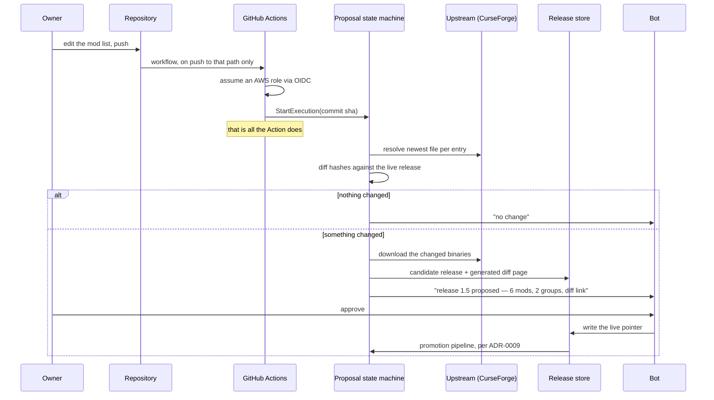

# ADR-0028 — Mod updates arrive as proposals: resolve, diff by hash, owner approves, promote

- Status: Proposed
- Date: 2026-08-12
- Milestone: M3
- Extends: [ADR-0008](0008-versioned-mod-releases.md) and [ADR-0009](0009-s3-as-mod-source-of-truth.md), which said what a
  release is and what promoting one does, but not where a candidate release comes from

## Context

[ADR-0008](0008-versioned-mod-releases.md) assumed releases are cut by hand: assemble a working mod set, run a command,
promote it. For 111 mods resolved from upstream project URLs, that is the wrong shape — nobody is going to check 111
projects for new versions by hand, so in practice the set would freeze until something forced a change.

The gap it leaves is the one identified in [ADR-0008](0008-versioned-mod-releases.md): mods live on the disk, nothing
records which versions they are, and a rebuild re-resolves them to whatever is newest at that moment.

Both problems have the same answer, and it is the owner's: **make the update check a deliberate, reviewable event.**

## Decision

Updates are **proposals**, not deployments. The sequence:

| Step | What happens |
| --- | --- |
| Signal | A schedule, or a command from a surface. **Never on boot** — boot must stay fast and deterministic |
| Resolve | For each entry in the mod list, ask upstream for the newest file matching the Minecraft and loader version |
| Diff | Compare each resolved file's hash against the live release. Unchanged entries are ignored |
| Propose | If anything differs, write a **candidate release** to the release store and present the diff: which mods, from which version to which, with their changelog links |
| Approve | The owner approves or rejects. The candidate is durable, so approval can come a day later |
| Promote | Approval moves the live pointer, which runs the existing pipeline in [ADR-0009](0009-s3-as-mod-source-of-truth.md) — announce, save, stop, reconcile, start, health check, roll back on failure |

**Binaries are cached in the release store at proposal time**, not referenced. That is what makes the pin real, and it is
the only defence against an author withdrawing a version later. See [ADR-0008](0008-versioned-mod-releases.md).

### Not Terraform

The sketch this ADR comes from described the approval step as "propose a Terraform plan, admin approves, apply". The
interaction is exactly right — a plan, a gate, an atomic apply — but Terraform is the wrong implement for it, and
[ADR-0011](0011-terraform-for-infrastructure.md) already draws the line: Terraform owns resources, the pipeline owns
data. Mods are data.

Concretely, putting 111 mod versions in Terraform would mean state churn on every mod update, mod deployments coupled to
infrastructure applies, and a rollback that is a state revert rather than a pointer move. The release model gives the
same plan-approve-apply experience with a cheaper rollback and no state to corrupt. **Keep the interaction, change the
implement.**

### Batching

"Newest of everything, all at once" is how a modded server breaks. Interdependent mods must move together — the Mekanism
family, Applied Energistics and its API dependencies, Sinytra Connector against both Forge and the Fabric mods it
bridges — and forty simultaneous changes make a crash impossible to attribute.

So a proposal:

- **groups entries that must move together** and offers each group as one decision, rather than 111 independent ones;
- **checks declared dependencies** from the upstream metadata before offering an update, and withholds one whose
  dependencies are not satisfied;
- may be **approved in part**. Taking the Create group this week and leaving Mekanism for next is a normal outcome.

The health check and automatic rollback in [ADR-0009](0009-s3-as-mod-source-of-truth.md) catch a release that fails to
start. They do not catch one that starts and is subtly wrong, which is the real reason to keep batches small.

### Policy, so that review does not become a chore

The risk below is that a proposal nobody reviews becomes a backlog, and then a frozen set — which is where this started.
Infrastructure orchestration platforms solve it with policy as code: rules that decide which plans need a human and
which can apply themselves. See [docs/prior-art.md](../prior-art.md).

The same applies here, and the rules are simple enough to state now:

| Change | Needs approval? |
| --- | --- |
| Patch or minor version bump, no dependency change, no entry added or removed | No — apply, announce afterwards |
| Any mod added or removed by the commit | Yes |
| A major version, or a changed declared dependency | Yes |
| Anything touching the loader, the Minecraft version, or Sinytra Connector | Yes, always |
| More than a handful of groups moving at once | Yes |

Auto-applying the boring majority is what keeps the interesting minority actually read. The health check and rollback
in [ADR-0009](0009-s3-as-mod-source-of-truth.md) are what make auto-apply defensible at all — and the honest limit is
that they catch a failed start, not a subtly wrong one, so the boring category has to stay genuinely boring.

Start with everything requiring approval, and relax it only once the pipeline has promoted a few releases without
incident. A policy that auto-applies before the rollback is trusted is a way to break the server unattended.

### What players get

Every approved release publishes a **full client pack**, which is the supported path.

A **delta archive** — only the mods that changed — is published alongside it, as a convenience. It is a convenience
rather than the mechanism because a delta is only valid from the immediately preceding release: somebody two releases
behind who applies it ends up in a state that matches nothing. The delta names the release it applies from, and the
instructions say to take the full pack if in doubt.

### How a push becomes a deployment

**The Action is a thin client, and that is the decision worth making deliberately.** It would be easy to have the
workflow resolve the mods, hash them and write the release itself — it has a runner and network access. But the same
proposal has to be produced by the schedule as well, and two implementations of "resolve and propose" will drift. So the
Action only signals, exactly as the panel and the bots only call the control-plane API in
[ADR-0012](0012-web-control-panel.md). One mechanism, several triggers.

That also keeps the credentials clean. The workflow assumes a role through GitHub's OIDC provider — a short-lived
token, no access keys stored in the repository — and that role can do exactly one thing: start this state machine. The
CurseForge key never leaves Parameter Store, because GitHub never resolves anything.

The commit SHA travels into the candidate release's metadata, so every release traces back to the exact list that
produced it.

**Single-flight.** Two pushes in a minute must not race two proposals against the same live release. One proposal is
open at a time; a newer push supersedes a pending one rather than queueing behind it, because the newer list is by
definition the one wanted.

### Where the mod list itself lives

Not in the panel, and not in a form. **The mod list is a declaration and stays a file** — the 111 CurseForge URLs, in
git, edited the way they are edited today.

This is not a second source of truth beside the release store, which is what [ADR-0009](0009-s3-as-mod-source-of-truth.md)
was right to warn against. It is the ordinary relationship between a declaration and a resolved artefact: the list says
*which mods*, and the release says *which exact files, with which hashes* — the same relationship as a dependency
manifest and its lockfile. Editing the list proposes; only a promoted release deploys.

Keeping it a file buys review, history and a diff at no cost, and a push to it is a perfectly good second signal for a
proposal alongside the schedule.

### Where the state lives, and where it does not

**Not in a table: which mods are installed.** That is the release manifest in S3, and it is already the source of truth
under [ADR-0008](0008-versioned-mod-releases.md). A second copy in DynamoDB would be two records of the same fact, with
no answer to "which is right when they disagree" — and the manifest wins on every count that matters here: bucket
versioning gives its history for free, it is the artefact the client pack is generated from, and the running server
reconciles against it directly. Drift is detected by hashing what is on disk against it, and that result is transient,
so it does not need storing either.

**In a table: what upstream last looked like.** This is different state with a different shape, and it is genuinely
awkward without one:

| Key | Value |
| --- | --- |
| Mod project | Newest file identifier and hash seen upstream, when it was last checked, and which proposal it went into |

That is keyed lookup, written on every check, read on every check, and small — DynamoDB's shape rather than S3's. It
lets a check skip projects that have not moved, keeps a proposal from re-offering something already rejected, and gives
"nothing has changed since Tuesday" as a cheap answer instead of 111 requests.

Crucially it is a **cache, not a record**: rebuildable at any time by re-resolving from upstream, and losing it costs one
slow check rather than any history. Marking it as such in the table's own documentation is what stops it drifting into
being treated as the truth later.

This is the same split DynamoDB already earns elsewhere in the design — the link table in
[ADR-0019](0019-account-linking.md) and the tokens in [ADR-0021](0021-sign-in-from-linked-chat-account.md) are keyed
lookups too, while every artefact lives in S3.

## Consequences

**Good**

- Removes the manual work [ADR-0008](0008-versioned-mod-releases.md) quietly assumed, which would not have been done.
- Closes the rebuild gap: after the first proposal, every mod has a recorded version and a cached binary, so a fresh
  instance reproduces the running configuration exactly.
- Updates become reviewable. "These five changed, here are the changelogs" is a decision; "the server updated itself" is
  an incident.
- The diff is a by-product changelog for players, without anyone writing one.
- Partial approval means a risky family can wait without blocking everything else.

**Bad, or risky**

- Proposal machinery to build: resolution, hashing, dependency checking, grouping, presentation. More than cutting a
  release by hand, and it must be built before it saves anything.
- Grouping which mods must move together is judgement, and getting it wrong produces either noise or breakage.
- A proposal nobody reviews becomes a backlog, and then a stale set, which is where this started.
- Caching binaries means storing them, though [ADR-0023](0023-multiple-worlds.md) already content-addresses them.
- Upstream metadata quality varies; declared dependencies are not always complete.

**Mitigations**

- Build it after the pipeline in [ADR-0009](0009-s3-as-mod-source-of-truth.md) works by hand. A proposal that cannot be
  promoted safely is worse than no proposal.
- Start with no grouping beyond obvious families, and add groups when something breaks. The rollback is the safety net.
- Notify the pending proposal to chat and repeat weekly. A silent backlog is the failure mode.
- Keep the first proposal manual — resolve the 111 URLs once and record the result as release 1.0 — before automating
  the recurring case.

## Alternatives considered

| Option | Why not chosen |
| --- | --- |
| Resolve at boot, as the current config does | No machinery at all, and it works while the disk persists. Makes boot depend on upstream and re-resolves on every rebuild, which is the gap being closed |
| Auto-approve and rely on rollback | Fully automatic, and the health check does catch a failed start. Does not catch a start that succeeds and is subtly wrong, and it removes the human judgement that batching needs |
| Pin everything and never update | Perfectly reproducible and eventually unplayable — mods fix bugs and add things players want |
| Terraform plan and apply for mod versions | The interaction this ADR keeps. Wrong implement: state churn, coupling to infrastructure applies, and an expensive rollback. See above |
| A general dependency updater pointed at a manifest | The right idea from another ecosystem, and worth stealing the interaction from. Nothing off the shelf understands mod-loader compatibility or CurseForge metadata |

## Open questions

- Where the diff is presented. Chat is fine for five mods and poor for forty; a link to a rendered diff is probably right.
- Whether an approval can be scoped to "everything except this one", or only to whole groups.
- How a proposal expires. A month-old candidate has probably been superseded upstream and should be re-resolved rather
  than promoted.
- ~~Whether to check the resolved set against a test start on a throwaway instance before offering it.~~ Answered by
  [ADR-0029](0029-preview-environments.md): every proposal opens a pull request that builds one, against a copy of the
  real world. That also widens what the policy above can safely call boring.
