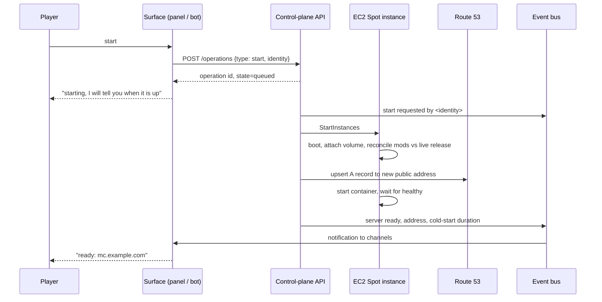
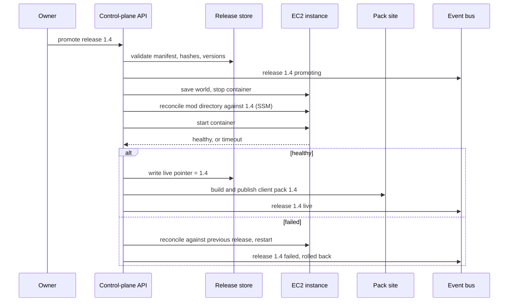

# Architecture

Current as of 2026-08-11, and describing the intended design, not a deployed system. Nothing here is built
yet. Where a decision is still open, the ADR that owns it is linked.

## Components

| Component | Runs on | Responsibility |
| --- | --- | --- |
| Game server | Docker on one EC2 Spot instance | Runs the world. Nothing else |
| Data volume | EBS, survives the instance | The world, the mod directory, configs |
| Control-plane API | API Gateway + Lambda | The only thing allowed to change state. Owns every rule |
| Operation store | DynamoDB (assumed) | State of long-running actions: start, promote, restore |
| Lifecycle automation | Lambda + EventBridge | Idle check, interruption handler, post-session backup |
| Release store | S3, versioned | Immutable releases and the live pointer |
| Backup store | S3, versioned, lifecycle rules | World archives |
| Event bus | SNS | One topic. Every notable event is published to it |
| Chat adapters | Lambda per platform | Format events for Discord and Telegram; receive commands |
| Identity | Cognito user pool | Google sign-in, and a custom flow for bot-issued sign-in links. Chat commands are authenticated by the platform itself |
| Link table | DynamoDB | Maps a chat account to an internal identity. Doubles as the allow-list and as the chat sign-in route. See [ADR-0019](adr/0019-account-linking.md), [ADR-0021](adr/0021-sign-in-from-linked-chat-account.md) |
| Web panel and pack site | S3 + CloudFront | Static. Panel is a client of the API; packs are files |
| DNS | Route 53 | One short-TTL record, rewritten on every start |
| Observability | CloudWatch + Budgets | Metrics, logs, alarms; alarms deliver to the event bus |

Boundaries that matter:

- **Surfaces hold no rules.** The panel, both bots and the CLI only call the API. See [ADR-0012](adr/0012-web-control-panel.md).
- **Terraform owns resources, the pipeline owns data.** Mods and world are never Terraform's business. See
  [ADR-0011](adr/0011-terraform-for-infrastructure.md).
- **The instance is disposable.** Everything that cannot be regenerated lives on the data volume or in S3.

## Flow 1 — Start

Notes

- The operation is not *ready* until the server answers a status ping **and** DNS resolves to the new
  address. Either one alone gives a player a broken connection and no explanation.
- A second start request while one is in flight joins the existing operation. It must never start a second
  instance. See [ADR-0016](adr/0016-chat-integrations.md).
- Whether the DNS write is made by the Lambda or by the instance is still open. The Lambda is safer, since
  the permission then does not sit on an internet-facing host. See [ADR-0017](adr/0017-stable-server-address.md).

## Flow 2 — Idle stop

1. A scheduled rule invokes the idle check every few minutes, but only while the instance is running.
2. The check reads the player count. A failed read counts as "not empty", never as empty.
3. After N consecutive empty readings, the stop sequence runs: save the world, confirm the save, stop the
   container, archive the world to S3, verify the archive, stop the instance.
4. Session length and archive result are published to the event bus.

The order matters. Archiving before the container stops risks a half-written world; stopping the instance
before verifying the archive risks a silent backup failure. See [ADR-0010](adr/0010-world-persistence-and-backups.md).

## Flow 3 — Release promotion

The weakest link is the health check. A modded server that is loading slowly and one that has hung look
identical for the first few minutes, so the timeout has to come from a measured normal start time, and there
must be an explicit "still starting" state. See [ADR-0009](adr/0009-s3-as-mod-source-of-truth.md).

## Flow 4 — Spot interruption

1. The interruption notice arrives, giving roughly two minutes.
2. Save the world, confirm, stop the container cleanly.
3. Publish the event, so players get an explanation rather than a silent disconnect.
4. Archive to S3 if time allows. If it does not, the world on the volume is still consistent.
5. The next start reattaches the same volume. Nothing is restored.

Two minutes is enough for a save and a clean stop, and may not be enough for an upload. The design must
degrade in that order.

## Security posture

| Concern | Position |
| --- | --- |
| Inbound network | Security group opens the game port only. No SSH port exists. See [ADR-0007](adr/0007-ssm-instead-of-ssh.md) |
| Host access | SSM Session Manager and Run Command only. No key pair on the instance |
| Instance permissions | Instance profile scoped to the two buckets it needs, and nothing else |
| Lambda permissions | Per-function roles. SSM send limited to instances carrying the project tag |
| Who may act | Two roles: player may start and read, owner may promote and restore. Being linked is what makes a chat account authorised at all |
| Identity | Cognito user pool with Google sign-in. Verified signatures for both bots — Ed25519 for Discord, secret token for Telegram — so the platform does the authenticating. Payload identity is never trusted unverified. See [ADR-0018](adr/0018-identity-and-sign-in.md) |
| Account linking | One-time code, generated in the panel, redeemed in the bot. Linking grants no privilege and never changes a role. See [ADR-0019](adr/0019-account-linking.md) |
| Chat sign-in | Only into an already linked identity. Bot issues a single-use, one-minute link, in a direct message only. No just-in-time provisioning: a chat account never creates an identity. See [ADR-0021](adr/0021-sign-in-from-linked-chat-account.md) |
| Token hygiene | Link codes and sign-in tokens live in separate tables with different shapes, so one can never be redeemed at the other endpoint |
| Secrets | Bot tokens and RCON password in SSM Parameter Store, encrypted. Never in Terraform state or the repository |
| Public surfaces | Pack site and panel are public; the API requires identity on every request |
| Audit | CloudTrail records every SSM command and every API call. Operations record their requester |
| Data | No personal data beyond a chat platform user ID and display name, held only to authorise and attribute. Unlinking deletes the record |

## Failure modes

| Failure | Detection | Effect | Response |
| --- | --- | --- | --- |
| Spot interruption | Interruption notice | Session ends | Save, stop, announce; reattach on next start |
| Spot capacity unavailable | Start operation fails | Cannot play | Try other instance types, then fall back to on-demand |
| Instance boots, container does not | Health check timeout | Server unreachable | Announce failure; if caused by a promotion, roll back automatically |
| Bad mod promoted | Health check, or crash loop alarm | Server unusable | Automatic rollback to the previous release |
| DNS not updated | Start operation never reaches ready | Up but unreachable by name | Operation reports failure with the raw address as a fallback |
| Idle check misreads player count | — | Players disconnected mid-session | N consecutive readings required; failed read counts as not empty |
| Stop path fails silently | Running-hours alarm | Money burned | Alarm to chat; Budgets alarm as backstop |
| Backup fails silently | Archive verification | No recovery point | Alarm to chat. Treated as the most serious failure here |
| World corruption noticed late | Players report | Data loss | Graded backup retention: daily, weekly, monthly |
| Volume or region loss | — | Total loss of the volume | Restore from S3 archive into a new volume |
| Chat platform outage | Commands time out | No chat control | Panel and owner CLI remain available |
| Google sign-in outage | Panel login fails | No panel for new sessions | `/panel` from a linked chat account still signs in; owner CLI remains available |
| Chat account not linked | Command refused | That person cannot use chat commands | Refusal names the link flow. See [ADR-0019](adr/0019-account-linking.md) |

## Open architectural questions

Collected from the ADRs, in rough order of how much they would change the design.

1. **Region.** Still unchosen, and it fixes latency and price. [ADR-0002](adr/0002-host-on-aws.md)
2. **Cold start duration.** The whole on-demand model rests on it being tolerable. [ADR-0006](adr/0006-on-demand-start-and-idle-shutdown.md)
3. **Health check for a modded start.** The weakest part of the release pipeline. [ADR-0009](adr/0009-s3-as-mod-source-of-truth.md)
4. **Where operation state lives**, and whether Step Functions fits the promotion sequence better than a
   Lambda plus a table. [ADR-0012](adr/0012-web-control-panel.md)
5. **Content-addressed mod storage** versus per-release copies. [ADR-0008](adr/0008-versioned-mod-releases.md)
6. **Pack format**, and whether to reuse `packwiz` for the export. [ADR-0013](adr/0013-modpack-distribution.md)
7. **Whether anybody refuses a Google account for first contact.** It is the only route that *creates* an
   identity; after that, a linked chat account signs in. Email sign-in with SES is the fallback if somebody will
   not use it at all. [ADR-0018](adr/0018-identity-and-sign-in.md), [ADR-0021](adr/0021-sign-in-from-linked-chat-account.md), [ADR-0020](adr/0020-email-channel.md)
