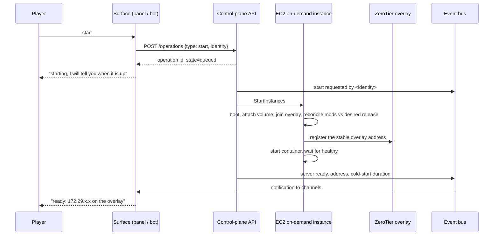

# Architecture

Describes the intended design of the whole system, so much of it reads in the future tense. Most of it is now built —
the on-demand game host, its storage, backups with a tested restore, Lifecycle V2 start and stop, the Telegram bot and
Mini App, Telegram identity with Owner approval, the release pipeline and promotion, worlds with their wipes. What is
not: the Discord surface, update proposals, preview environments, the derived whitelist. The [README](../README.md)
separates those two; this document does not, because its subject is the design rather than the current build. Where a
decision is still open, the ADR that owns it is linked.

Three things have settled since this was written on 2026-08-11, and the text below reflects them: the server runs
**on-demand**, not on Spot ([ADR-0032](adr/0032-on-demand-single-instance.md)); it is reachable only over a
**ZeroTier overlay** ([ADR-0024](adr/0024-connectivity-modes.md)), not a public DNS name; and browser identity is
**Telegram only** ([ADR-0037](adr/0037-telegram-only-browser-identity.md)), not a Cognito broker with Google.

## Components

| Component | Runs on | Responsibility |
| --- | --- | --- |
| Game session stack | Docker Compose on one on-demand EC2 instance | Minecraft plus session-local Prometheus, Grafana and exporters; all stop together |
| Data volume | EBS, survives the instance | The world, the mod directory, configs |
| Control-plane API | API Gateway + Lambda | The only thing allowed to change state. Owns every rule |
| Operation orchestration | Step Functions, Standard workflows | Runs the long operations. The execution **is** the operation state, so there is no table for it. See [ADR-0025](adr/0025-step-functions-for-long-operations.md) |
| Lifecycle automation | Step Functions + Lambda + DynamoDB | Lifecycle V2: a fenced lease and session record per server, one watchdog execution per session, and the verified stop it invokes. The interruption handler exists only if Spot is ever adopted |
| Release store | S3, versioned | Immutable release artefacts per preset; world records and, per wipe, separate desired and active release state |
| Backup store | S3, versioned, lifecycle rules | World archives |
| Events | EventBridge + SNS | Step Functions and EC2 publish lifecycle observations; a projector records bounded event history and a current control-plane view. Alarms and the budget publish to the `spawnpoint-alert` SNS topic |
| Chat adapters | Lambda per platform | Telegram today: a webhook command bot and a notifier fed by execution events. Discord is designed, not built |
| Identity | Access Lambda + DynamoDB | Verifies signed Telegram browser/Mini App identity and issues a short-lived Spawnpoint session; roles grant access separately. See [ADR-0037](adr/0037-telegram-only-browser-identity.md) |
| Access directory | DynamoDB | Maps Telegram, game and network accounts to an internal identity, role and direct grants. The bot and panel read the same authority |
| Web panel and pack site | S3 + CloudFront | Static. Panel is a client of the API; packs are files |
| Connectivity | An overlay agent on the instance today; Route 53 or a raw address are the other two modes of the same contract | Publishes the connection string on start and retracts it on stop. One contract, three implementations; **ZeroTier is the chosen mode**. See [ADR-0024](adr/0024-connectivity-modes.md) |
| Observability | Session Prometheus/Grafana + CloudWatch + Budgets | Detailed live game/host dashboard during play; durable AWS signals and alarms after the instance is gone |

Boundaries that matter:

- **Surfaces hold no rules.** The panel, both bots and the CLI only call the API. See [ADR-0012](adr/0012-web-control-panel.md).
- **Terraform owns resources, the pipeline owns data.** Mods and world are never Terraform's business. See
  [ADR-0011](adr/0011-terraform-for-infrastructure.md).
- **The instance is disposable.** Everything that cannot be regenerated lives on the data volume or in S3.

## Local development topology

The control plane has a first-class local execution mode; it is not limited to running the Minecraft container by
hand. The same ASL state machines and TypeScript Lambda handlers run against LocalStack, while a Docker host adapter
maps the EC2/SSM boundary to the local Compose session. S3, DynamoDB, SNS and EventBridge retain their AWS-shaped APIs.
Notifications terminate in a local event sink, and infrastructure-only failures such as unavailable Spot capacity are
injected explicitly rather than pretended to be faithfully emulated.

This environment is for behavioural development and failure testing. Real AWS acceptance tests still own IAM, Spot,
EBS/AZ, networking, quotas and timing. LocalStack is opt-in because its current distribution requires a licence and
auth token; unit tests remain independent of it. See
[ADR-0031](adr/0031-first-class-local-control-plane.md).

## Flow 1 — Start



Notes

- The operation is not *ready* until the server answers a status ping **and** the connection string published by
  the active connectivity mode actually works. Either one alone gives a player a broken connection and no
  explanation. See [ADR-0024](adr/0024-connectivity-modes.md).
- A second start request while one is in flight joins the existing operation. It must never start a second
  instance. See [ADR-0016](adr/0016-chat-integrations.md).
- In the chosen overlay mode the instance registers its own membership, so this leg needs no AWS permission and no
  internet-facing host holds a DNS credential. The Lambda-versus-instance question only returns if DNS mode is ever
  revived. See [ADR-0024](adr/0024-connectivity-modes.md).

## Flow 2 — Idle stop

1. A watchdog execution, launched with the session, probes the player count every few minutes for as long as the
   session lasts. Nothing is scheduled, and nothing runs between sessions.
2. The check reads the player count. A failed read counts as "not empty", never as empty.
3. After N consecutive empty readings, the stop sequence runs: save the world, confirm the save, stop the
   container, archive the world to S3, verify the archive, stop the instance.
4. Session length and archive result are published to the event bus.

The order matters. Archiving before the container stops risks a half-written world; stopping the instance
before verifying the archive risks a silent backup failure. See [ADR-0010](adr/0010-world-persistence-and-backups.md).

## Flow 3 — Release promotion

```mermaid
sequenceDiagram
    participant O as Owner
    participant API as Control-plane API
    participant S3 as Release store
    participant EC2 as EC2 instance
    participant SITE as Pack site
    participant BUS as Event bus

    O->>API: promote release 1.4
    API->>S3: validate manifest, hashes, versions
    API->>API: create deployment operation; write desired=1.4
    API->>BUS: release 1.4 promoting
    API->>EC2: save world, stop container
    API->>EC2: reconcile mod directory against 1.4 (SSM)
    API->>EC2: start container
    EC2-->>API: healthy, or timeout
    alt healthy
        API->>API: commit active=1.4
        API->>SITE: build and publish client pack 1.4
        API->>BUS: release 1.4 live
    else failed
        API->>EC2: reconcile against previous active release, restart
        API->>API: reset desired to previous active release
        API->>BUS: release 1.4 failed, rolled back
    end
```

The weakest link is the health check. A modded server that is loading slowly and one that has hung look
identical for the first few minutes, so the timeout has to come from a measured normal start time, and there
must be an explicit "still starting" state. The pointer mechanics moved to [ADR-0030](adr/0030-desired-and-active-release.md);
the health-check question itself is still open.

## Flow 4 — Spot interruption

**Designed, not in use.** The server runs on-demand ([ADR-0032](adr/0032-on-demand-single-instance.md)), which is not
interrupted. This flow becomes real only if [ADR-0027](adr/0027-spot-request-shape.md) is adopted; it is kept because
adopting Spot is a launch-configuration change, not a redesign.

1. The interruption notice arrives, giving roughly two minutes.
2. Save the world, confirm, stop the container cleanly.
3. Publish the event, so players get an explanation rather than a silent disconnect.
4. Archive to S3 if time allows. If it does not, the world on the volume is still consistent.
5. The next start reattaches the same volume. Nothing is restored.

Two minutes is enough for a save and a clean stop, and may not be enough for an upload. The design must
degrade in that order.

## What runs when nobody plays

**Nothing.** There is no process anywhere in this system that has to stay up. That is the central claim of the
design, and it is worth being able to defend component by component, because the obvious implementation of almost
every component here would have needed a permanent one.

### Zero fixed compute

| Component | Why nothing runs |
| --- | --- |
| Web panel and pack site | Static files on S3 behind CloudFront. No server, no rendering, no process |
| Discord bot | Registered slash commands delivered to an **interactions endpoint**. Discord POSTs a signed request when somebody uses a command. Between commands there is nothing |
| Telegram bot | **Webhook**, not long polling. Telegram POSTs to the endpoint |
| Control-plane API | API Gateway in front of Lambda. One handler per operation |
| Long operations | Step Functions state machines. A `Wait` state costs nothing while waiting, unlike a Lambda polling in a loop — which is why this row belongs here rather than in the table below. See [ADR-0025](adr/0025-step-functions-for-long-operations.md) |
| Release pipeline | Standard Workflows started explicitly — a GitHub Action for a build, an owner or the panel for a promotion. Idle otherwise |
| Idle watchdog | A Step Functions execution per session, launched by the start and ending with the stop. Its `Wait` states cost nothing |
| Interruption handler | An EventBridge rule on the Spot notice, only if Spot is ever adopted. Nothing polls for it |
| Identity | Login verification runs only on Lambda requests; there is no continuously billed identity service |
| Link and token state | DynamoDB in **on-demand** capacity mode |
| Control-plane view | EventBridge invokes a projector only when provider state changes; it writes DynamoDB, emits a sanitized invalidation to ticket-protected WebSockets, and one-shot Step Functions retries reconciliation after a stopped host or failed operation outlives its lease |
| The game server itself | Started on request, stopped when idle. See [ADR-0006](adr/0006-on-demand-start-and-idle-shutdown.md) |

Two of those rows are also traps, and are decisions rather than details:

- **DynamoDB must stay in on-demand mode.** Provisioned capacity is billed continuously, which would quietly
  reintroduce exactly what this section exists to prevent.
- **The watchdog lives exactly as long as its session.** A rule firing every few minutes forever would be cheap, but
  it is a process-shaped thing pretending not to be one; one execution per session, started and ended with it, is free.

### Billed continuously anyway — and it is all storage

Distinct question from "what runs", and the one that actually shapes the bill:

| Item | Note |
| --- | --- |
| EBS data volume | The dominant fixed cost. Billed whether the instance runs or not |
| S3: releases, backups, site | Cheap, and grows with retained releases and worlds |
| Route 53 hosted zone | DNS connectivity mode only |
| CloudWatch stored logs | Which is why retention is finite and short |
| Overlay network account | Free tier, but the membership exists continuously |

So the honest summary: **no fixed compute, and a few US dollars a month of fixed storage.** See [docs/costs.md](costs.md).

### What was given up to keep it that way

This property was not free. Each of these is the more capable option, and each was declined because it needs
something permanently up:

| Declined | Would have cost | Recorded in |
| --- | --- | --- |
| A gateway-connected Discord bot, able to react to ordinary messages | A process holding a WebSocket, always | [ADR-0016](adr/0016-chat-integrations.md) |
| Telegram long polling, which needs no public endpoint or certificate | A process, always | [ADR-0016](adr/0016-chat-integrations.md) |
| A proxy holding the player's connection while the server boots — the nicest possible wake | A process, always | [ADR-0006](adr/0006-on-demand-start-and-idle-shutdown.md) |
| Self-hosted Prometheus and Grafana, with far better dashboards | A host, always | [ADR-0015](adr/0015-observability-and-alerting.md) |
| A ready-made hosting panel such as Pterodactyl | A host, always | [ADR-0003](adr/0003-build-not-reuse.md) |
| Kubernetes | A control plane, roughly $70 a month before any node | [ADR-0014](adr/0014-no-kubernetes.md) |
| A private subnet, which is the conventional posture | A NAT Gateway, roughly $32 a month | [ADR-0032](adr/0032-on-demand-single-instance.md) |

Seven temptations, one rule, applied consistently. That consistency is why the fixed cost is storage and nothing else.

### The one thing that could break the rule

Discord requires an interaction to be acknowledged within a few seconds. A Lambda that has been idle for days has to
cold-start, verify an Ed25519 signature, and reply inside that window. It should fit, and it is the tightest deadline
in the system.

If it turns out not to fit, the usual remedy is provisioned concurrency — which **is** an always-on cost, and would be
the first crack in this rule. Cheaper answers to try first: a faster runtime, a smaller deployment package, and doing
nothing before the acknowledgement except verifying the signature. See [ADR-0016](adr/0016-chat-integrations.md).

## Security posture

| Concern | Position |
| --- | --- |
| Inbound network | Security group has no inbound rules in the chosen ZeroTier mode. Neither the game nor SSH is public. See [ADR-0007](adr/0007-ssm-instead-of-ssh.md) and [ADR-0024](adr/0024-connectivity-modes.md) |
| Who may join the game | **`online-mode=false`**, so Minecraft itself verifies nothing: the whitelist keeps out unknown names, not unknown people. The **network is the access boundary** — see the connectivity mode below. `enforce-whitelist=true` kicks anybody removed from the derived whitelist. See [ADR-0022](adr/0022-minecraft-account-as-linked-identity.md) |
| Connectivity mode | Pluggable: raw address, DNS on an owned domain, or an overlay network with no inbound port. Only the overlay mode supplies the gate that `online-mode=false` depends on, so it is the mode for any world worth keeping. See [ADR-0024](adr/0024-connectivity-modes.md) |
| Operator privileges | `ops.json` is kept empty or near-empty. In offline mode an op entry is a name anybody reaching the port can claim, so administration goes through RCON from the control plane instead |
| Host access | SSM Session Manager and Run Command only. No key pair on the instance |
| Instance permissions | Instance profile scoped to the two buckets it needs, and nothing else |
| Lambda permissions | Per-function roles. SSM send limited to instances carrying the project tag |
| Who may act | Four built-in roles — viewer, player, operator, owner — plus direct grants on one identity. A Telegram account is authorised only once an Owner has approved it into an identity. See [ADR-0036](adr/0036-observed-visitors-and-owner-approved-access.md) |
| Identity | The access Lambda verifies Telegram Login Widget signatures and Mini App `initData`. The webhook secret authenticates bot transport; both surfaces then resolve the same Telegram account in the access directory. See [ADR-0037](adr/0037-telegram-only-browser-identity.md) |
| Account linking | Today an Owner records a player's game and network accounts in the profile. The self-serve one-time code of [ADR-0019](adr/0019-account-linking.md) is designed, not built. Linking grants no privilege and never changes a role |
| Browser sign-in | Telegram Login Widget redirects signed user data to the panel, which exchanges it for a 12-hour Spawnpoint session. Authentication creates at most a Visitor/access candidate; Owner approval creates the identity and role |
| Secrets | Bot tokens and RCON password in SSM Parameter Store, encrypted. Never in Terraform state or the repository |
| Public surfaces | Pack site and panel are public; the API requires identity on every request |
| Audit | CloudTrail records every SSM command and every API call. Operations record their requester |
| Data | No personal data beyond a chat platform user ID and display name, held only to authorise and attribute. Unlinking deletes the record |

## Failure modes

| Failure | Detection | Effect | Response |
| --- | --- | --- | --- |
| Spot interruption — *deferred; on-demand does not interrupt* | Interruption notice | Session ends | Save, stop, announce; reattach on next start. Live only if [ADR-0027](adr/0027-spot-request-shape.md) is adopted |
| Capacity unavailable at start | Start operation fails | Cannot play | Rare for a single on-demand type; retry, or the owner picks another type. The Spot-to-on-demand fallback once written here is retracted — AWS discourages it. See [ADR-0027](adr/0027-spot-request-shape.md) |
| Instance boots, container does not | Health check timeout | Server unreachable | Announce failure; if caused by a promotion, roll back automatically |
| Bad mod promoted | Health check, or crash loop alarm | Server unusable | Automatic rollback to the previous release |
| Connection string not published | Start operation never reaches ready | Up but unreachable | Operation reports failure; in DNS mode the raw address is the fallback |
| Overlay coordination service unavailable | New device cannot join | Newcomers blocked, existing devices unaffected | Owner can switch connectivity mode and restart. See [ADR-0024](adr/0024-connectivity-modes.md) |
| Wrong world's release applied to a world's save | Reconciliation refuses on mismatch | Would corrupt a world | Required world parameter, never defaulted, plus a pre-flight check. See [ADR-0023](adr/0023-multiple-worlds.md) |
| Idle check misreads player count | — | Players disconnected mid-session | N consecutive readings required; failed read counts as not empty |
| Stop path fails silently | Running-hours alarm | Money burned | Alarm to chat; Budgets alarm as backstop |
| Backup fails silently | Archive verification | No recovery point | Alarm to chat. Treated as the most serious failure here |
| World corruption noticed late | Players report | Data loss | Graded backup retention: daily, weekly, monthly |
| Volume or region loss | — | Total loss of the volume | Restore from S3 archive into a new volume |
| **Account closure** | Billing notice, or silence | Total loss of everything, including the backups | Paid Plan rather than Free Plan, and one copy of the world held outside AWS. See [docs/costs.md](costs.md) |
| Chat platform outage | Commands time out | No chat control | Panel and owner CLI remain available |
| Telegram sign-in outage | Panel login and bot commands fail | No new browser sessions or chat control | Existing browser sessions continue until token expiry; owner CLI remains available |
| Chat account not linked | Command refused | That person cannot use chat commands | Refusal names the link flow. See [ADR-0019](adr/0019-account-linking.md) |
| Whitelist projection writes an empty list | Reconciliation refuses to write it | Would lock the whole group out | Empty result treated as a bug; manual path in the runbook. See [ADR-0022](adr/0022-minecraft-account-as-linked-identity.md) |
| Username-to-UUID API unavailable | Binding fails | No new players can be added | Existing bindings are cached, so play is unaffected |

## Open architectural questions

Collected from the ADRs, in rough order of how much they would change the design.

1. ~~**Region.**~~ **Settled: `eu-central-1`.** Players are in Poland, Ukraine and western Russia. [ADR-0002](adr/0002-host-on-aws.md), [docs/measurements.md](measurements.md)
2. ~~**Cold start on the real instance.**~~ **Measured:** on 2026-08-26 the host reached Minecraft healthy 96 seconds into the session command, on release 1.1; EC2 boot and SSM registration come before that. Tolerable, and the whole on-demand model rests on it staying so. [ADR-0006](adr/0006-on-demand-start-and-idle-shutdown.md), [docs/runbook.md](runbook.md)
3. **Health check for a modded start.** The weakest part of the release pipeline, and still open: the gate today is the host's readiness contract behind the SSM command timeout. [ADR-0030](adr/0030-desired-and-active-release.md)
4. **Whether the surfaces read execution state directly or through a flattened API view**, so they do not depend on
   Step Functions' own vocabulary. [ADR-0025](adr/0025-step-functions-for-long-operations.md)
5. **Content-addressed mod storage** versus per-release copies. [ADR-0008](adr/0008-versioned-mod-releases.md)
6. **Pack format**, and whether to reuse `packwiz` for the export. [ADR-0013](adr/0013-modpack-distribution.md)
7. ~~**Whether anybody refuses a Google account for first contact.**~~ **Settled: Google is gone.** Telegram is the
   only browser identity, and an Owner approves the first contact. [ADR-0037](adr/0037-telegram-only-browser-identity.md),
   [ADR-0036](adr/0036-observed-visitors-and-owner-approved-access.md)
